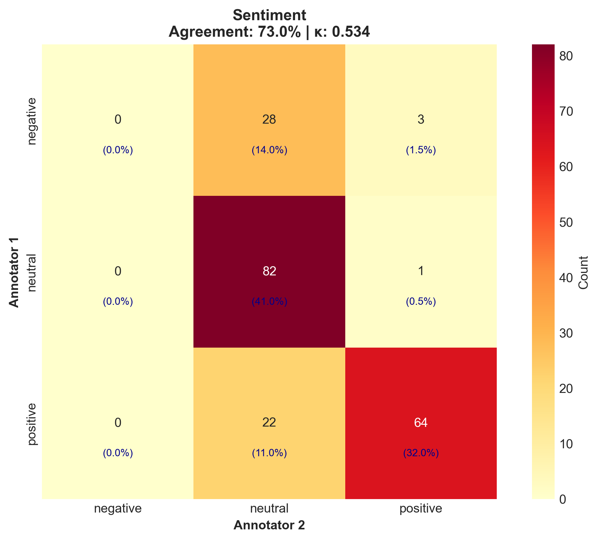
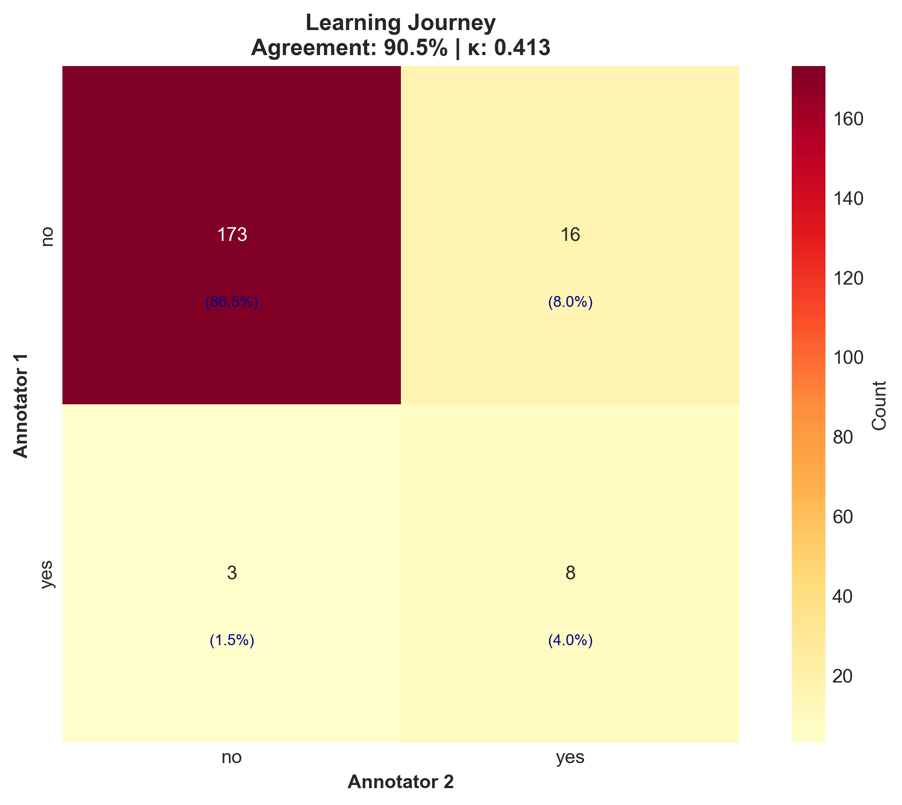
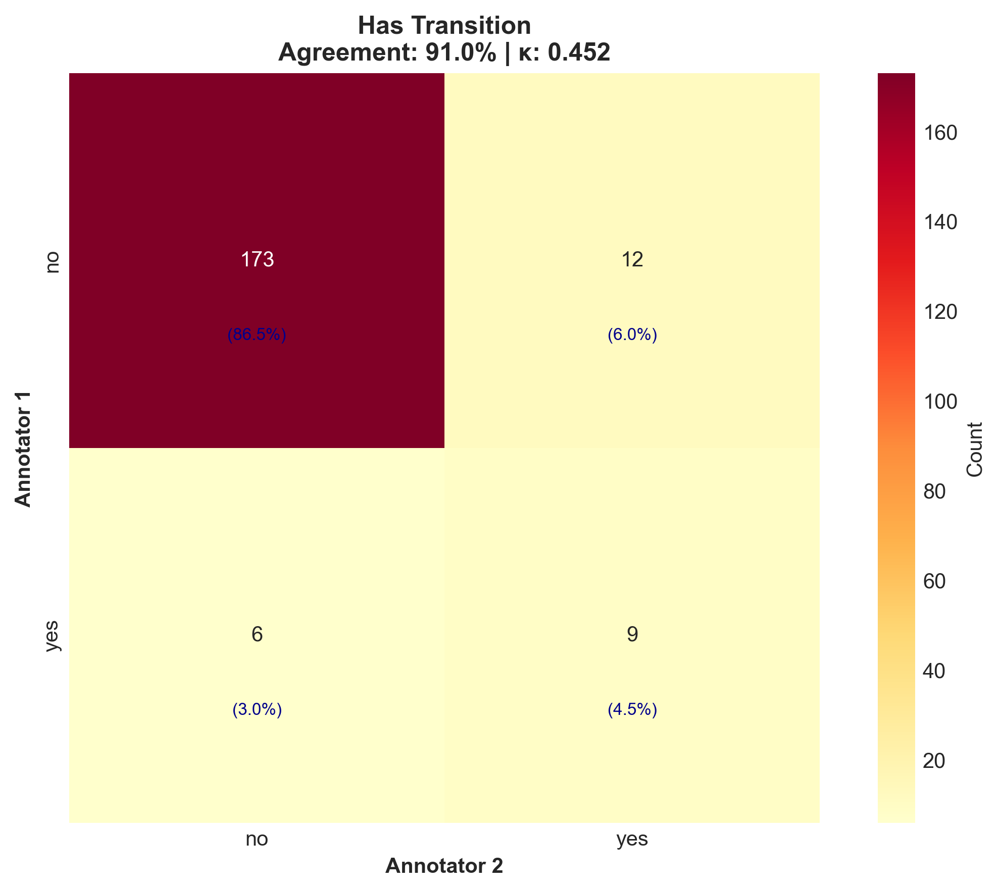
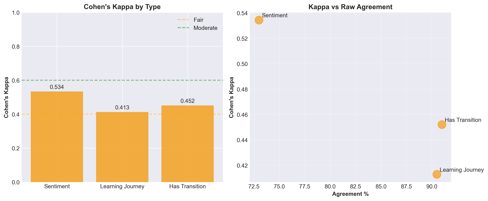
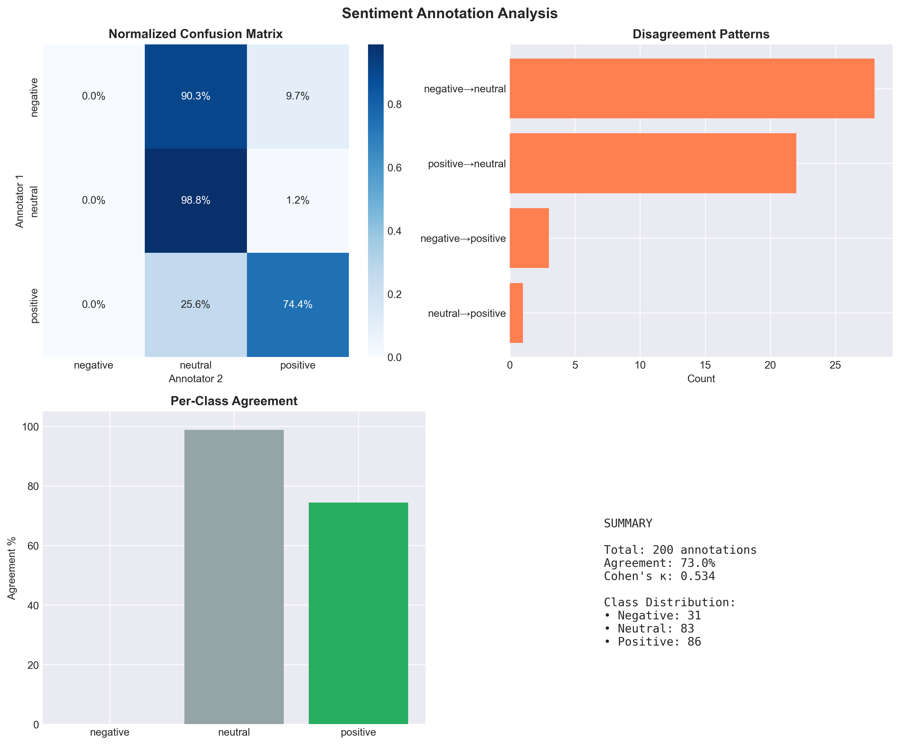

# Inter-Annotator Agreement Analysis

**Date:** 2025-08-27 19:05  
**Annotations:** 200

## Results Summary

| Type | Cohen's κ | Interpretation | Agreement % |
|------|-----------|----------------|-------------|
| Sentiment | 0.534 | Moderate | 73.0% |
| Learning Journey | 0.413 | Moderate | 90.5% |
| Has Transition | 0.452 | Moderate | 91.0% |

## Visualizations

### Confusion Matrix - Sentiment

### Confusion Matrix - Learning Journey

### Confusion Matrix - Has Transition

### Kappa Comparison

### Sentiment Analysis

